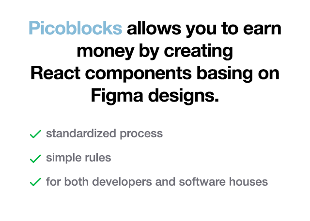

# Picoblocks - what, how and why?

---

### This repository contains instructions on working with Picoblocks.
### It also serves as a sample showcase of the component structure in a Picoblocks-enabled repository.

---

## Tech stack
What do you need to know when working with Picoblocks?

- You need to have a decent knowledge of React and it's component-based approach of creating the UI
- TypeScript is a must!
- We use Tailwind CSS framework (https://tailwindcss.com/) for styling
- All components are being (re)viewed in Storybook
- You're going to know the basics of Figma (as a viewer)
- Finally, basics of Git and GitHub are going to be required: branches, merging, pull requests, projects

## What does the process look like?

1. We make sure that NDA is signed by both parties
2. We provide you with new batch of components' designs on Figma
3. You analyze the batch and give us an estimate
4. We greenlight the estimate
5. The tasks on GitHub projects are assigned to you
6. You proceed with development on a separate branch
7. Upon finishing, you create a pull request
8. We accept the pull request (or give you a feedback)
9. After the acceptance, the payment is being processed

## How the components should be made?

- All components are designed using Figma Flow methodology
  - [...explanation from the Figma Flow paper]
- Tailwind CSS should be used for styling
  - It's possible to extend Tailwind CSS by modifying `tailwind.config.js`
  - If Tailwind CSS capabilities are not sufficient (e.g. transitions, animations) - you can use CSS modules
- End result should be visible in Storybook (not in the web app itself)
  - If component have multiple variants or significantly differing states, prepare a stories for all cases
- No component should use any kind of store, global state nor cause any application-wise side effects
  - Components should just use props and state. Where possible, create TypeScript typings for them.

## What commands should I use?

1. Clone the repository from GitHub
2. Run `yarn` command
3. Run `yarn nx storybook <project-name>` e.g. `yarn nx storybook picoblocks-sample-repo`
4. Write the code!

## What's in this sample repository?

- This repository contains components made basing on the following Figma project:
  - https://www.figma.com/file/hp8PEd7DwT5G9C97okLNZd/UI-TodoApp?node-id=93%3A5284
- The components code resides in the `apps/picoblocks-sample-repo/src/components` directory
  - Each component has its own `.tsx` file and respective `.stories.tsx` file with the Storybook entry

## FAQ

- **Who is doing the code review?**
  - At this point the employess od EYEDEA, but we are planing more open system in future.
- **What if I'll can deliver components? Is there any penalty?**
  - No worries! Just let us know and we will send it back to the backlog. No penalty.
- **Are you planing to support other technologies?**
  - Yes! Every component system is ready to be managed by Picoblocks. Drop us email and we can discuss further.
- **Why I need to sign NDA?**
  - You are going to work with projects which are not necessery open-source in this case we have to protect our customers.
- **[Question?]**
  - [Answer]
- **[Question?]**
  - [Answer]
- **[Question?]**
  - [Answer]

